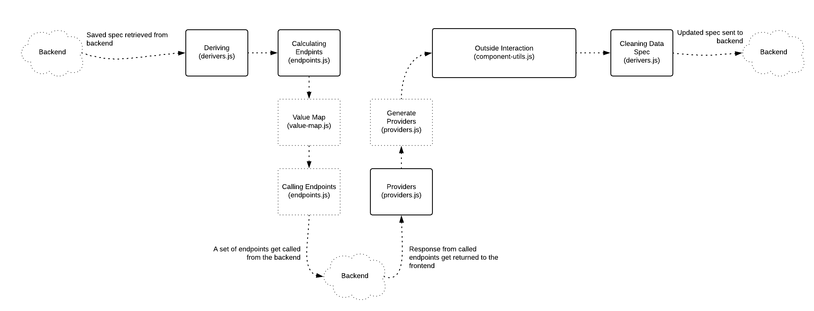

# 2. Flow
* [Deriving The Sepcs](deriving.md)
* [Calling endpoints](endpoints.md)
* [Mapping to Providers](mapping_providers.md)
* [Interacting with the specs](interaction_with_specs.md)
* [Cleaning the spec](cleaning.md)

Now that we know what everything that relates to the spec engine is, lets talk about the process of how the spec engine works with these different parts. This chapter aims to describe from start to finish, what the spec engine does in it's different steps and how you interact with it.

Heres a simple graph that you can refer to when reading this chapter. It visualizes the different parts of the engine and in what files they occur. The solid squares represent parts of the spec that needs to be called manually by the user of the engine, and the dotted squares are parts that are being called internally in each step.

